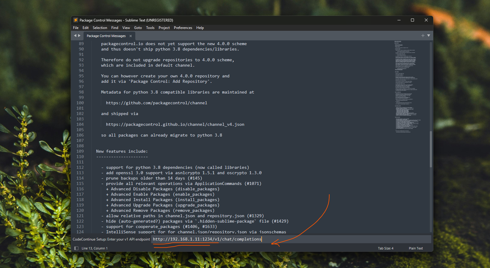
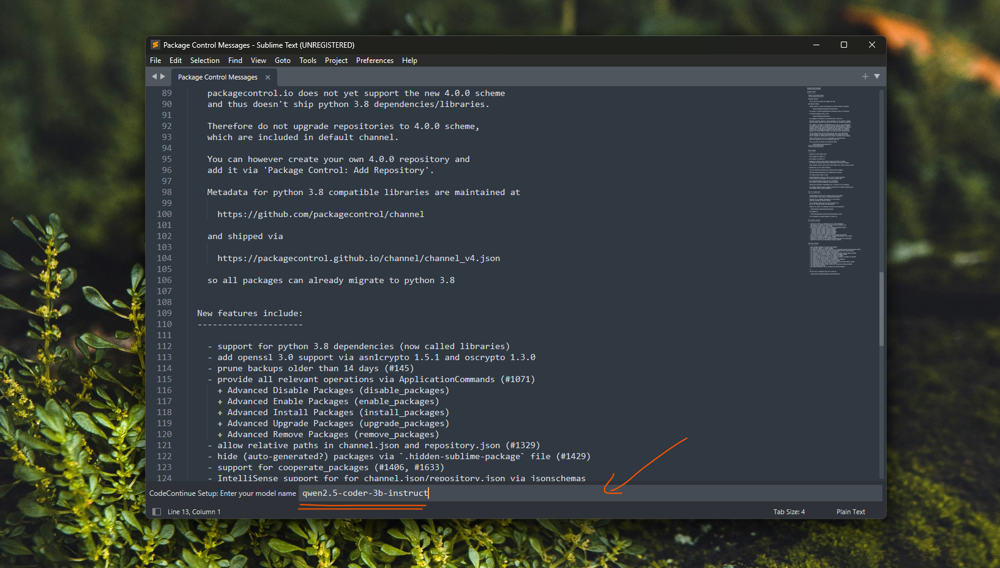
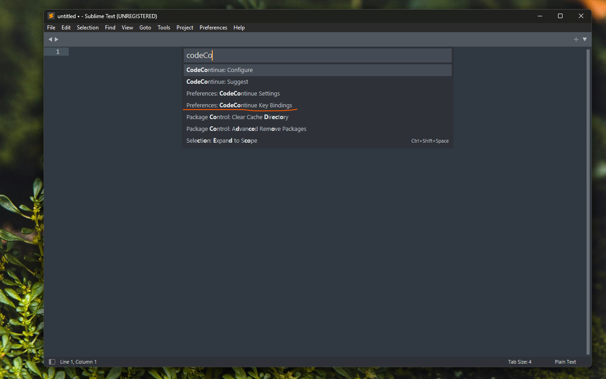
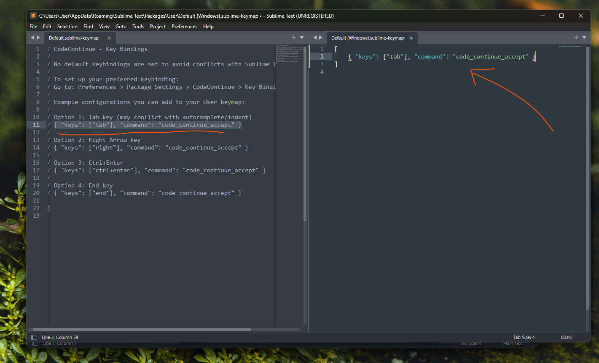

# CodeContinue - AI Code Completion for Sublime Text


An LLM-powered Sublime Text plugin that provides intelligent inline code completion suggestions, in-place code editing, and code chat using OpenAI-compatible or Anthropic APIs. Check out the [CodeContinue blog post here](https://www.orbital.net.in/blog/codecontinue-llm-powered-sublime-text-autocomplete).

## Features

- **Fast inline code completion**: Powered by your choice of local or cloud LLM.
- **Inline Edit & Refactor**: Select code >> right-click >> **CodeContinue: Edit Selection** to rewrite code using natural language instructions.
- **Chat about code**: Select code >> right-click >> **CodeContinue: Chat about Selection** to discuss code in an interactive split-view chat.
- **Automatic Endpoint & Model Discovery**: Paste your server address (e.g. `http://localhost:1234` or `https://api.openai.com`); CodeContinue automatically normalizes the URL and detects available models from `/v1/models`.
- **Flexible Keyboard Shortcuts**: `Enter` to suggest, `Tab` to accept (⚠️ Note: Keybindings are customizable and enabled via settings).
- **Multi-Provider Support**: Works out-of-the-box with OpenAI, Anthropic, LM Studio, Ollama, vLLM, and local OpenAI-compatible servers.
- **Context-aware**: Uses surrounding code context to produce accurate suggestions.

## Installation

### Option 1: Install via Package Control (Recommended)

1. Open the command palette via `Ctrl + Shift + P` (or `Cmd + Shift + P` on macOS).
2. Type `Package Control: Install Package` and press Enter.
3. Search for `CodeContinue` and press Enter to install.
4. **Configure CodeContinue**:
   - The setup wizard appears automatically on first run (or run `Ctrl+Shift+P` >> `CodeContinue: Configure`).
   - Enter your endpoint URL (e.g. `http://localhost:1234` for LM Studio or `https://api.openai.com`).
   - Select your model from the auto-detected list or enter it manually.




### Enable Key Bindings
Keybindings are not enabled by default to prevent conflicts with existing packages.

To enable keybindings:
1. Open the command palette (`Ctrl + Shift + P`).
2. Type `Preferences: CodeContinue Key Bindings` and press Enter.
3. Add your preferred keybinding to the User keymap (e.g. `Tab`, `Right Arrow`, or `Ctrl+Enter`):

```json
[
    { "keys": ["tab"], "command": "code_continue_accept" }
]
```





### Option 2: Manual Install (For Developers)


<details>
<summary>Click to view manual installation options</summary>

1. **Python CLI Installer**

```bash
python tools/install.py
```
Interactive command-line installer with auto-detection, connectivity pre-flight check, and dynamic model discovery.

2. **GUI Installer**
   
```bash
python tools/install_gui.py
```
Cross-platform Tkinter graphical installer with automatic model detection and customizable configuration.

</details>

## Configuration
<details>
<summary>Click to expand configuration options</summary>

Settings are saved automatically in `Packages/User/CodeContinue.sublime-settings`. Reconfigure anytime via `Ctrl+Shift+P` >> `CodeContinue: Configure`.

- **endpoint**: Your API endpoint URL - **Required**
  - LM Studio: `http://localhost:1234`
  - Ollama: `http://localhost:11434`
  - OpenAI: `https://api.openai.com` (or `https://api.openai.com/v1/chat/completions`)
  - Anthropic: `https://api.anthropic.com` (or `https://api.anthropic.com/v1/messages`)

- **model**: The model name for completions - **Required**
  - Examples: `qwen2.5-coder-3b-instruct`, `gpt-4o`, `claude-3-5-sonnet-20241022`

- **api_key**: Authentication key (optional)
  - Required for cloud providers (e.g. `sk-...` for OpenAI, `sk-ant-...` for Anthropic).
  - Leave blank for local endpoints that do not require auth.

- **max_context_lines**: Number of surrounding code lines sent to the model (default: `30`).

- **timeout_ms**: Request timeout in milliseconds (default: `30000`).

- **trigger_language**: Array of language scopes to enable completion for (e.g. `["python", "cpp", "javascript", "typescript", "go", "rust"]`).

- **system_prompt**: Custom system prompt for inline completions.
  - Leave blank (`""`) to use the built-in default expert prompt.
  - Set a custom prompt to tune smaller models or suppress docstrings/comments.

- **debug**: Enable debug logging (default: `false`).
  - Set to `true` to view detailed request/response logs in `View >> Show Console`.

</details>

## Requirements

- Sublime Text 4
- Python 3.8+ (bundled with Sublime Text 4)
- Access to a local LLM runner (LM Studio, Ollama, vLLM) or a cloud API (OpenAI, Anthropic, etc.)

## Troubleshooting

<details>
<summary>Click to expand troubleshooting tips</summary>

### Setup wizard not appearing
- Restart Sublime Text: `File >> Exit`, then reopen.
- Manually run: `Preferences >> Package Settings >> CodeContinue >> Settings` or `Ctrl+Shift+P` >> `CodeContinue: Configure`.

### Suggestions not appearing
- Check that the current file's syntax matches an entry in `trigger_language`.
- Verify your API endpoint is accessible.
- Enable debug logging (`"debug": true`) and check `View >> Show Console`.
- Make sure keybindings are configured in `Preferences: CodeContinue Key Bindings`.

### Timeout errors
- Increase `timeout_ms` in settings (e.g. `45000` for larger local models).
- Check that your local LLM server is running and responding.

### Authentication or connection errors
- Verify your API key is correct.
- For local servers (LM Studio / Ollama), ensure the local server is started and listening on the configured port.

</details>

## Advanced Configuration Examples

<details>
<summary>Click to expand provider configuration examples</summary>

**Local LM Studio:**
```json
{
    "endpoint": "http://localhost:1234/v1/chat/completions",
    "model": "qwen2.5-coder-3b-instruct"
}
```

**Local Ollama:**
```json
{
    "endpoint": "http://localhost:11434/v1/chat/completions",
    "model": "qwen2.5-coder:3b"
}
```

**OpenAI:**
```json
{
    "endpoint": "https://api.openai.com/v1/chat/completions",
    "model": "gpt-4o",
    "api_key": "sk-your-openai-key"
}
```

**Anthropic:**
```json
{
    "endpoint": "https://api.anthropic.com/v1/messages",
    "model": "claude-3-5-sonnet-20241022",
    "api_key": "sk-ant-your-anthropic-key"
}
```

</details>

## License

See [LICENSE](LICENSE) file for details.

